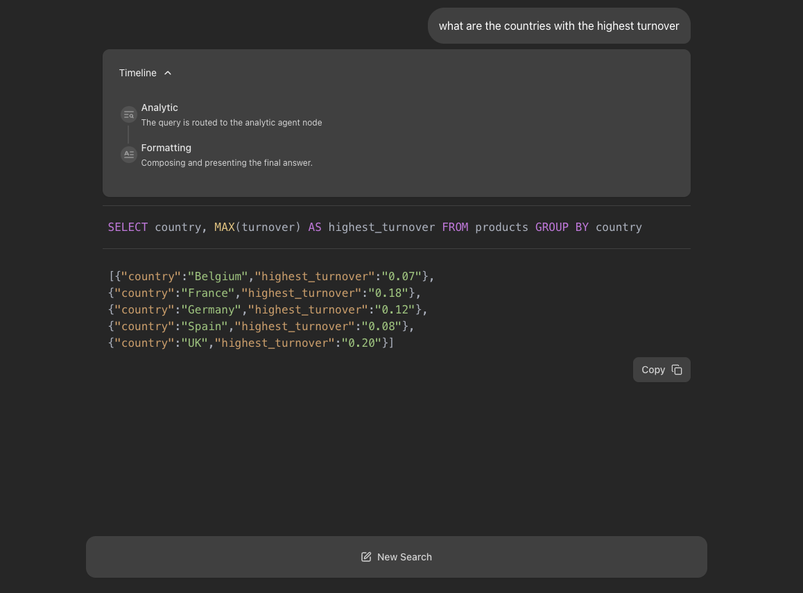
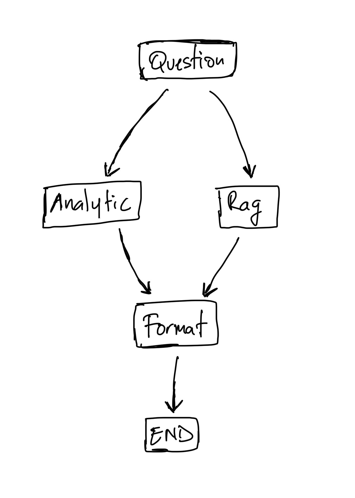

# Hybrid RAG & Analytics Service



this project is a fullstatck data integration project that has data store locally and here is what the program does

1. Ingest & index raw data into a vector store.
2. Retrieve relevant context for free-text questions.
3. Perform ad-hoc analytics for SQL-style queries.
4. Generate natural-language answers via OpenAI, with a persona flag to adjust tone.
5. Expose a simple HTTP API.
6. Containerise with Docker.
   it performs a “Text-to-Query” service over a small dataset. the data has some file located in the backend/data folder and from that source the store folder is create and contains the sqlite for both the files and then embeddings.

the provided files are products.csv and rules.md

and here are the key highlight of this project

## Features

- 💬 Fullstack application with a React frontend and LangGraph backend (which represent each state of execution as a node).
- 🤔 Reflective routing to identify which action to perform (rag-based or analytics) knowledge gaps and refine searches.

## Project Structure

The project is divided into two main directories:

- `frontend/`: Contains the React application built with Vite.
- `backend/`: Contains the LangGraph/FastAPI application, including the agent logic.

## Getting Started: Development and Local Testing

Follow these steps to get the application running locally for development and testing.

**1. Prerequisites:**

- Node.js and npm (or yarn/pnpm)
- Python 3.11+
- **`OPEN_API_KEY`**: The backend agent requires a OPEN API key.
  1.  Navigate to the `backend/` directory.
  2.  Create a file named `.env` by copying the `backend/.env.example` file.
  3.  Open the `.env` file and add your Gemini API key: `GEMINI_API_KEY="YOUR_ACTUAL_API_KEY"`

**2. Install Dependencies:**
use uv as package manager
**Backend:**

```bash
cd backend
uv sync
```

**Frontend:**

```bash
cd frontend
npm install
```

**3. Run Development Servers:**

**Backend:**

```bash
cd backend
uv langgraph dev --allow-blocking
```

**Frontend:**

```bash
cd backend
uv langgraph dev --allow-blocking
```

_The backend API will be available at `http://127.0.0.1:2024\docs`. It will also open a browser window to the FastAPI docs where request can be accessed. For the frontend, open a terminal in the `frontend/` directory and run `npm run dev`. The frontend will be available at `http://localhost:5173/app`_

The core of the backend is a LangGraph agent defined in `backend/src/agent/graph.py`. It follows these steps:



## Deployment

**1. Build the Docker Image:**

Run the following command from the **project root directory**:

```bash
docker build -t hybrid-rag-service -f Dockerfile .
```

**2. Run the Production Server:**

```bash
OPENAI_API_KEY=<your_open_api_key> LANGSMITH_API_KEY=<your_langsmith_api_key> docker-compose up
```

Open your browser and navigate to `http://localhost:8123/app/` to see the application. The API will be available at `http://localhost:8123`.

## Technologies Used

- [React](https://reactjs.org/) (with [Vite](https://vitejs.dev/)) - For the frontend user interface.
- [Tailwind CSS](https://tailwindcss.com/) - For styling.
- [Shadcn UI](https://ui.shadcn.com/) - For components.
- [LangGraph](https://github.com/langchain-ai/langgraph) - For building the backend research agent.
- [Open AI](https://platform.openai.com/docs/models) - LLM for query generation and answer synthesis.
